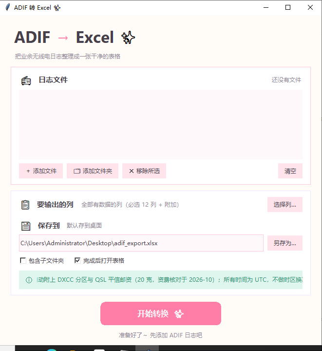
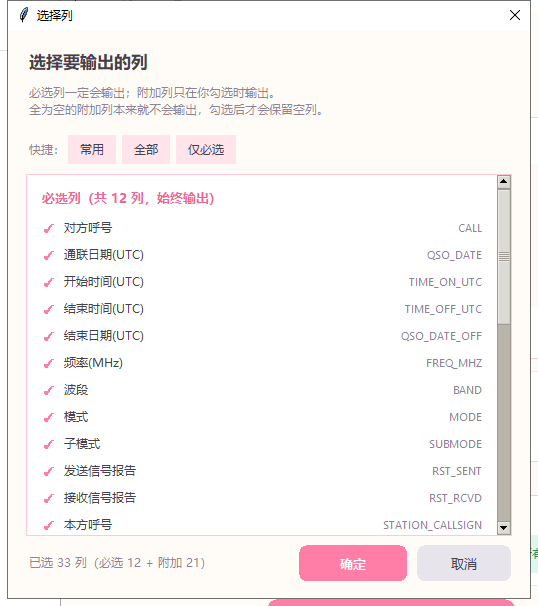

# ADIF → Excel ✨

**把 LoTW / QRZ / Club Log / N1MM / JTDX / TQSL 导出的业余无线电日志，整理成一张干净的 Excel 表格。**

保留原始数据 · 自动识别字段（不硬编码）· 附 DXCC 实体与 QSL 平信邮资 · 时间一律 UTC

> ### 🤖 关于作者
>
> **本项目的全部代码、测试与文档，均由 DeepSeek Harness + DeepSeek-V4.1-Flash Max 编写。**
>
> This project was written by **DeepSeek Harness + DeepSeek-V4.1-Flash Max**.

[](https://github.com/ba4ihb/ADIF-2-XLSX/actions/workflows/tests.yml)
[](LICENSE)
[](#语言的构成)
[](#语言的构成)
[](#语言的构成)
[](#环境要求)
[](#下载)
[](src/dxcc_tables.py)
[](#自己验证这个工具)

---

## 目录

- [下载](#下载)
- [网页版怎么运行（先读这一段）](#网页版怎么运行先读这一段)
- [快速开始](#快速开始)
- [界面与功能](#界面与功能)
- [输出的 Excel](#输出的-excel)
- [DXCC 实体 ≠ 国家](#dxcc-实体--国家)
- [QSL 邮资（中国邮政 平信）](#qsl-邮资中国邮政-平信)
- [时间处理](#时间处理请务必读一下)
- [隐私](#隐私)
- [环境要求](#环境要求)
- [命令行用法](#命令行用法)
- [语言的构成](#语言的构成)
- [项目结构](#项目结构)
- [自己验证这个工具](#自己验证这个工具)
- [架构说明](#架构说明)
- [已知限制](#已知限制)
- [开源协议](#开源协议)

---

## 直接用（推荐）：浏览器版

**打开就用，不用下载、不用安装、不用跑任何本地程序：**

### 👉 [https://ba4ihb.github.io/ADIF-2-XLSX/web.html](https://ba4ihb.github.io/ADIF-2-XLSX/web.html)

把 `.adi` / `.adif` 拖进页面 → 选好要输出的列 → 点开始 → Excel 直接下载。

- **转换在你的浏览器里完成**，日志不上传、不联网、没有服务器
- 首次打开下载约 **10 MB** 的 Python 运行时，之后浏览器缓存，**秒开**
- 手机、平板、Mac、Linux 上一样能用（桌面版只支持 Windows）

### 它是怎么做到的

本项目的转换逻辑是 Python。浏览器版通过 [Pyodide](https://pyodide.org/)
（CPython 编译成 WebAssembly）把**同一份 `src/adif2xlsx.py` 跑在页面里**，
所以它不是"用 JavaScript 重写的另一份实现"，而是**同一个转换器换了个运行位置**。

这意味着网页版和桌面版**不会各自漂移** —— 这一点由测试强制：
`tests/test_browser_edition.py` 会在真实的无头浏览器里跑一次转换，
核对打包进页面的源码与 `src/` **逐字节相同**，并要求输出与桌面版**逐单元格一致**。

> 相关脚本：
> - `tools/build_web_assets.py` — 打包 Python 源码 + 下载 openpyxl/et_xmlfile 纯 Python wheel
> - `tools/build_browser_page.py` — 由 `web/index.html` 生成 `web/browser.html`（复制到 `docs/web.html`）
>
> 后者每次都会**先刷新打包的源码并校验与 `src/` 一致**，所以"页面里跑的是旧代码"
> 这种最难查的问题在构建阶段就被挡住了。

---

## 下载（备选）

不想等那 10 MB，或者网络不便？到 [**Releases**](../../releases/latest) 页面下载。
每个 ZIP **解压即用**，不需要装 Python，不需要装任何东西。**功能和浏览器版完全一致。**

| ZIP | 用途 | 解压后双击 |
|-----|------|-----------|
| `adif2xlsx-web.zip` | **网页版**（推荐日常使用） | `启动网页版.bat` |
| `adif2xlsx-ui.zip` | **桌面窗口版**（不想跑服务就选这个） | `adif2xlsx-ui.exe` |
| `adif2xlsx-cli.zip` | **命令行版**（批量、脚本） | 在终端里调用 `adif2xlsx.exe` |

三个版本**功能完全一致** —— 同一份转换代码、同一套列选项、同样的输出。
区别只在交互方式。详见 [界面与功能](#界面与功能)。

发布包里另有 `SHA256SUMS.txt`，可用 `certutil -hashfile <文件> SHA256` 校验。

### 从源码运行

```bash
git clone <this repo>
cd adif2xlsx
pip install openpyxl
python src/adif2xlsx.py            # 图形界面
python src/webapp.py               # 网页版（自动开浏览器）
python src/adif2xlsx.py log.adi -o 结果.xlsx   # 命令行
```

---

## 网页版怎么运行

**有两种网页版，别混了：**

| | 浏览器版（推荐） | 本机服务版（下载包里） |
|---|---|---|
| 打开方式 | 直接访问网址 | 双击 `启动网页版.bat` |
| 需要下载 | 不用 | 需要下 ZIP（约 32 MB） |
| 需要跑程序 | **不用** | 需要（那个黑色窗口） |
| 日志去哪 | **不离开浏览器** | 不离开本机 |
| 首次等待 | 约 10 MB 运行时 | 约 8–60 秒启动 |
| 平台 | 任何有浏览器的地方 | Windows |

### 浏览器版

点 [这个链接](https://ba4ihb.github.io/ADIF-2-XLSX/web.html) 就行。
页面会用 Pyodide 把真正的 Python 转换器加载进浏览器，转换在页面内完成。
**首次打开要下载约 10 MB**（Pyodide 运行时 + openpyxl），之后走浏览器缓存。

### 本机服务版（为什么它也存在）

浏览器**不能**直接把文件写到你磁盘上任意位置，也不能可靠地读取一个文件夹里的
几十个 ADI 文件。本机服务版把这些交给一个小程序，界面仍然是浏览器。
**注意它只监听 `127.0.0.1`**，其他机器连不上。

### 为什么不用 JavaScript 重写一遍

| 方案 | 代价 |
|------|------|
| JavaScript 重写解析与写 xlsx | **两份实现必然逐渐不一致** —— 正是要避免的 |
| ✅ Pyodide 跑同一份 Python | 首次多下 10 MB，之后缓存；行为天然一致 |

本项目选了后者：**一份代码，三种界面**。

---

## 快速开始

### 网页版

1. 解压 `adif2xlsx-web.zip`（建议放在**英文路径**下）
2. 双击 `启动网页版.bat` —— 会弹出一个黑色命令行窗口，**转换期间不要关掉它**
3. 浏览器自动打开；把 `.adi` / `.adif` 文件**拖进页面**
4. 选好要输出的列，点「开始转换」，Excel 直接下载

> 浏览器没自动打开？手动访问黑窗口里显示的地址，形如
> `http://127.0.0.1:8000/?token=...`。那串 token 每次运行都不一样。

### 桌面版

解压 `adif2xlsx-ui.zip`，双击 `adif2xlsx-ui.exe`，拖文件进去，点转换。
输出路径留空则保存到桌面，也可以自己指定。

### 命令行

```bat
adif2xlsx.exe log1.adi log2.adi -o 汇总.xlsx
adif2xlsx.exe 日志文件夹 -o 汇总.xlsx
adif2xlsx.exe 日志文件夹 -o 汇总.xlsx --columns required
adif2xlsx.exe --list-fields
```

---

## 界面与功能

三种界面是同一份代码的三个入口，功能逐项对齐：

| 功能 | 网页版 | 桌面版 | 命令行 |
|------|:------:|:------:|:------:|
| 多文件拖入 / 多选 | ✅ | ✅ | ✅（参数） |
| 整个文件夹批量 | ✅ | ✅ | ✅ |
| 列选择（常用 / 全部 / 仅必选 / 逐列勾选） | ✅ | ✅ | `--columns` |
| 必选列始终输出 | ✅ | ✅ | ✅ |
| 自动识别可选字段 | ✅ | ✅ | ✅ |
| DXCC 实体 + 判定来源 | ✅ | ✅ | ✅ |
| QSL 平信邮资 | ✅ | ✅ | ✅ |
| 合并多个日志为一个工作簿 | ✅ | ✅ | ✅ |
| `SOURCE_FILE` 列 | ✅ | ✅ | ✅ |
| 输出位置 | 浏览器下载 | 桌面 / 自选 | `-o` |
| 中文界面 | ✅ | ✅ | 输出中文列标签 |

命令行另外提供 `--list-fields`（列出所有可输出的列）和退出码区分（见 [命令行用法](#命令行用法)）。

---

## 输出的 Excel

两张工作表。

### 工作表 `QSOs`

- **第 1 行**：英文列名（大写）—— 这是文档化的接口，公式和脚本按它来
- **第 2 行**：中文标签 —— 给人看
- **第 3 行起**：数据，每条通联一行
- 冻结窗格固定在 `A3`，自动筛选覆盖整个数据区
- 日期和时间是**真正的 Excel 日期/时间值**，不是文本，可以直接排序、相减

**必选列**（9 个，永远输出，即使全空 —— 缺了这些就不算一份日志）：

`CALL` `QSO_DATE` `TIME_ON_UTC` `FREQ_MHZ` `BAND` `MODE`
`RST_SENT` `RST_RCVD` `STATION_CALLSIGN`

另有三个**自动生成列**也永远输出：`SOURCE_FILE`、`DXCC_ENTITY`、`QSL_POSTAGE_AIR`。

**常见可选列**（映射到 ADIF 字段，有数据才输出）：
`TIME_OFF_UTC` `QSO_DATE_OFF` `SUBMODE`，以及日志里出现的其余全部字段。

> `TIME_OFF_UTC`、`QSO_DATE_OFF`、`SUBMODE` 曾经被列为"必选"，
> 但实际在所有记录都为空时会被丢弃 —— 文档和界面因此和真实行为不一致。
> 现在它们明确是可选列：**有数据才输出**，符合"全空则不输出该列"这条规则。

**附加列不硬编码。** 工具扫描 ADI 中**实际出现**的所有 ADIF 字段，各自成为一列：

- 字段在**所有**记录中都是空的 → **不输出该列**
- `APP_*`（程序自定义字段）按 `ADIF` 规范归并到 `APP_PROGRAMID_FIELDNAME`
- 同名但大小写不同的字段会合并

所以不同来源的日志导出的列不完全一样，这是刻意的。

### 工作表 `Summary`

| 区块 | 内容 |
|------|------|
| **第 1 行** | **数据来源与空单元格说明**（合并单元格，自动换行）—— 一眼可见 |
| 按波段 / 按模式统计 | 各值出现次数 |
| 通联最多的呼号 | Top 50 |
| 总览 | 总条数、去重呼号数、日期范围、ADIF 版本、导出程序、邮资依据 |
| 来源文件 | 每个源文件的记录数 |
| 各列填充情况 | 每列「已填 / 总数 / 比例」，**全空的行标黄** |

第 1 行那段说明（也是回答"为什么这格是空的"）：

> 数据来源与空单元格说明：本表数据全部来自源 ADI 文件，按 ADIF 字段名映射后原样写出，
> 时间一律为 UTC、不做时区换算；标 [自动生成] 的几列由本工具计算得出，不是源文件内容。
> 单元格为空表示源 ADI 中没有相应数据 —— 多数导出软件本身就不提供某些字段
> （例：LoTW、QRZ Logbook 不导出 RST，Club Log、TQSL 不导出 STATION_CALLSIGN），
> 所以空单元格、乃至整列为空，都不代表转换出错。
> 本表最下方「各列填充情况」逐列列出实际填充数，供对照。

---

## DXCC 实体 ≠ 国家

这是本工具最容易出错、也最值得说清楚的部分。

**一个"国家"可能包含多个 DXCC 实体：**

| 国家 | 对应的 DXCC 实体 |
|------|-----------------|
| 中国 | 大陆(`B<数字>`) · 香港(`VR2`) · 澳门(`XX9`) · **台湾**(`BM`–`BQ`,`BU`–`BW`,`BX`) · 黄岩岛(`BS7`) |
| 俄罗斯 | 欧洲部分(区号 1–7) · 亚洲部分(区号 8/9/0) · 加里宁格勒(`UA2`/`RA2`) |
| 美国 | 本土 · 夏威夷(`KH6/7`) · 阿拉斯加(`KL/AL/NL`) · 波多黎各(`KP3/4`) · 关岛 · 威克岛 … |
| 法国 | 本土 · 科西嘉 · 瓜德罗普 · 马提尼克 · 留尼汪 · 新喀里多尼亚 … |

**判定优先级：**

1. 日志自带的 `DXCC` 字段 —— **权威**，直接采用
2. 日志自带的 `COUNTRY` 字段
3. 呼号前缀（最长匹配 + 特殊规则）

### DXCC 表由 ARRL 官方列表生成

不再手写。由 `tools/` 下的脚本从 **ARRL DXCC List（2026 年 1 月版，340 个现有实体 + 62 个已删除实体）** 生成：

```bash
python tools/parse_arrl_pdf.py       <DXCC_Current.pdf> tools/data/arrl_dxcc_2026.txt
python tools/strip_glossary_notes.py <DXCC_Current.pdf> tools/data/arrl_dxcc_2026.txt
python tools/build_dxcc.py           # -> src/dxcc_tables.py
```

`src/dxcc_tables.py` 是**生成物，不要手改**。

**为什么必须这样。** 早期版本用了手写的编号表，而**编号是权威的** ——
LoTW、Club Log、N1MM 都会写 `DXCC` 编号，解析器优先信任它。当时犯的错：

| 呼号 | 日志里的编号 | 手写表判成 | ARRL 列表实际是 |
|------|-------------|-----------|----------------|
| `SP4DDS` | 269 | **多哥** ❌ | 波兰 |
| `E74K` | 501 | **约旦** ❌ | 波黑 |

结果是**国家错，邮资也错**。不是漏了两个，是整个编号体系错的。

**怎么保证解析正确。** PDF 会把呼号区号、脚注号、甚至实体名的一部分粘在前缀上，
一个格子可能长这样：

- `ZC442UK` = 分配 `ZC4` + 脚注 42 + 实体名里的 "UK"
- `JD119` = `JD1` + 脚注 19
- `OK-OL23` = 范围 `OK-OL` + 脚注 23

**不猜哪个数字是脚注** —— 而是把文末的**词汇表**也读出来：每条脚注自己写明它讲的是哪个分配
（`42   (ZC4) ...`），拿这个去格子里找。修正文字全部来自文档本身，可逐条核对。

另外，**60 个前缀被多个实体共用**（`FO` 同时属于法属波利尼西亚、南方群岛、马克萨斯、克利珀顿），
主要归属显式写在 `PRIMARY_PREFIX_OWNER` 里，子实体走更长前缀（`VK9X`、`KH7K`、`CE0X`）。

### 覆盖与限制

`tests/test_dxcc.py` 里有 **260 个区块的自动化审计**，逐个要求判定正确，覆盖度不会悄悄退化。
另有 40 余个呼号的实测清单，覆盖中国 B 段、俄罗斯区号、美国各州、稀有岛屿。

**诚实说明**：ARRL 列表里少数实体的编号无法在本环境中独立核实，这些实体**只报名字**
（报告和邮资用的就是名字），编号列显示前缀而**不编造数字**。日志自带的编号始终优先。

---

## QSL 邮资（中国邮政 平信）

按 **20 克平信（信函）** 计算，写入 `QSL_POSTAGE_AIR` 列。

| 目的地 | 资费（RMB） |
|--------|------------|
| 中国大陆 | **1.20**（单一数字） |
| 香港 / 澳门 / 台湾 | 航空 2.00 · 水陆路 1.50 |
| 国际分区 1 | 航空 5.00 · 空运水陆路 4.50 · 水陆路 3.50 |
| 国际分区 2 | 航空 5.50 · 空运水陆路 5.00 · 水陆路 4.00 |
| 国际分区 3 | 航空 6.00 · 空运水陆路 5.50 · 水陆路 4.00 |
| 国际分区 4 | 航空 7.00 · 空运水陆路 6.50 · 水陆路 4.00 |
| 不提供邮政服务 | 写「**不通邮**」并说明原因 |

- 只显示**信函**价格。**不提供明信片价格**（按需求移除）
- 挂号费、回执费等附加费用**不计入**
- 水陆路只对实际开办该业务的国家显示（191 个未开办的目的地不显示）
- **价格永远带出处**：Summary 表写明资费标准的**生效日期**和**核对日期**及来源。
  一个过期的价格比没有价格更糟

---

## 时间处理（请务必读一下）

- 输出**全部是 UTC**，**不做任何时区换算**
- 列名里明确写 `_UTC`（`TIME_ON_UTC`、`TIME_OFF_UTC`、`QSO_DATE_OFF`）
- 中文标签也写明「(UTC)」
- Summary 表再次声明

**你的日志里写的是什么时间，导出的就是什么时间。** 不猜、不改、不"帮你修正"。

---

## 隐私

| 措施 | 说明 |
|------|------|
| 完全本机 | 转换不联网，不调用任何外部服务 |
| 只监听回环 | 网页版服务绑定 `127.0.0.1`，其他机器无法访问 |
| 随机令牌 | 每次运行生成新 token，地址不带 token 一律拒绝 |
| 路径校验 | 静态文件请求做前缀检查，防目录穿越 |
| 临时文件即删 | 上传内容在转换完成后立刻删除 |
| 输出由浏览器下载 | 服务端不落盘（除非你自己在页面里填了保存路径） |
| 仓库无真实数据 | 测试用日志是**合成假呼号** |

**关于测试数据的核对**：仓库里 `tests/fixtures/adi/` 的六份日志，是从真实导出**脱敏**而来 ——
呼号被替换为**等长、且落在同一 DXCC 实体**的合成呼号，个人信息字段替换为占位符。
提交前用脚本核对过：**240 个合成呼号与原始文件的 240 个呼号重叠数为 0**，
且不含机主呼号、姓名、地址、邮箱、真实网格坐标。

`samples/` 下的示例日志是**手写的虚构数据**（`Bill`、`Honolulu` 之类），不含任何真实通联。

---

## 环境要求

| | |
|---|---|
| 操作系统 | Windows 10 / 11（64 位）。源码本身跨平台，本项目的打包脚本面向 Windows |
| Python（仅源码运行） | **3.10 或更高** |
| 依赖（仅源码运行） | [`openpyxl`](https://openpyxl.readthedocs.io/) ≥ 3.1（读写 xlsx） |
| 打包版 | **无依赖**，不需要装 Python |
| 网络 | **不需要** |

开发用到的完整工具链（仅贡献代码时需要）：`pyinstaller`（打包）、`ruff`（lint）、
`pypdf`（只在重新生成 DXCC 表时用到）。

---

## 命令行用法

```text
adif2xlsx.exe [输入...] [-o 输出.xlsx] [选项]
```

| 选项 | 说明 |
|------|------|
| `-o, --output` | 输出路径。默认写到桌面 `adif_export.xlsx` |
| `--columns LIST` | 只输出这些列（**必选列仍会输出**）。`--columns required` = 只要必选列 |
| `--list-fields` | 列出所有可输出的列名及中文标签，然后退出 |
| `--gui` | 强制打开图形界面 |
| `--quiet` | 不打印逐文件进度 |
| `-h, --help` | 帮助 |

输入可以是**文件、多个文件、或文件夹**（文件夹会递归收集 `.adi` / `.adif`）。

**退出码**

| 码 | 含义 |
|----|------|
| 0 | 成功 |
| 1 | 输入无法解析（文件损坏、不是 ADIF 等） |
| 2 | 参数错误，或输出路径不可写 |

---

## 语言的构成

按仓库中**非空代码行**统计（不含生成的 DXCC 表、构建产物和第三方数据）：

| 语言 | 行数 | 占比 |
|------|-----:|-----:|
| Python | 12 086 | **94.9 %** |
| HTML（单文件前端） | 617 | **4.8 %** |
| Batchfile（启动脚本） | 32 | **0.3 %** |
| **合计** | **12 735** | 100 % |

另有 Markdown 约 1 034 行、TOML 29 行（文档与配置，不计入代码占比）。

Python 占绝对多数是刻意的：**转换、DXCC、邮资、三种界面全部是同一份 Python 代码**，
网页前端只是一层薄界面，它自己不解析 ADIF —— 所以不存在"两份实现不一致"的问题。

统计脚本：`tools/lang_stats.py`。

---

## 项目结构

```text
adif2xlsx/
├── src/
│   ├── adif2xlsx.py      # 核心：ADIF 解析、字段映射、xlsx 写出、CLI
│   ├── dxcc.py           # DXCC 实体判定（特殊规则在这里）
│   ├── dxcc_tables.py    # 生成物：ARRL 实体与前缀表，勿手改
│   ├── postage.py        # 中国邮政平信资费与分区
│   ├── gui.py            # 桌面窗口界面（tkinter）
│   └── webapp.py         # 本机 HTTP 服务（仅标准库）
├── web/index.html        # 网页界面（单文件，零外部资源）
├── tools/                # DXCC 表生成、ARRL PDF 解析、语言统计
│   └── data/             # 已解析的 ARRL 列表（可复现，无需联网）
├── tests/                # 7 个测试套件 + 脱敏测试日志
│   └── fixtures/adi/     # 六个平台的真实导出（已脱敏）
├── samples/              # 手写示例
├── docs/                 # 本页与截图、验证报告
├── dist/                 # 打包输出（不提交到仓库）
├── build_exe.py          # 打包脚本
└── 启动网页版.bat         # 网页版启动入口
```

**架构要点**：`webapp.py` 只做 HTTP 收发，收到文件后**调用 `adif2xlsx.py` 里同一套函数**；
`gui.py` 同样如此。所以三种界面的输出是同一份结果，这也是"功能完全一致"的实现方式，
而不是靠人工对齐。

---

## 自己验证这个工具

```bash
python tests/run_all_tests.py                  # 单元 + 端到端
python tests/run_all_tests.py --all            # 再加打包版一致性 + 模糊测试
python tests/run_all_tests.py --with-gui --with-web
```

| 套件 | 检查数 | 覆盖内容 |
|------|-------:|---------|
| `test_enumerations.py` | 15 | ADIF 3.1.7 Submode 枚举与 MODE 表完全一致、无重复键 |
| `test_dxcc.py` | 48 | 260 个 ITU 区块判定正确；中国 B 段、俄罗斯区号、ADIF 编号优先 |
| `test_postage.py` | 56 | 每一条公布的资费、分区、SAL 开办情况、不通邮清单 |
| `test_acceptance.py` | 240 | 端到端契约：**从源 ADI 重新推导工作簿里的每一个值** |
| `test_frontend_parity.py` | 43 | **网页版与桌面版功能一致**：列目录/标签/预设同源，三个入口产出**逐单元格相同**的工作簿 |
| `test_browser_edition.py` | 47 | **浏览器版就是同一个转换器**：打包源码与 `src/` 逐字节相同；页面不调用任何服务；并在真实无头浏览器里实跑一次转换 |
| `test_gui.py` | 37 | 界面能构建并转换；无控制台时不会静默退出 |
| `test_web.py` | 68 | HTTP API：与命令行结果一致、列选择、下载、Zip 上传、令牌校验 |
| `test_exe.py` | 一致性 | 打包版与源码产出**逐单元格完全相同** |
| `test_fuzz.py` | 2000 输入 | 任何输入都不打印异常堆栈、不产生损坏的工作簿 |

当前状态：**默认 6/9 套件、449 项检查全部通过（`python tests/run_all_tests.py`），`ruff check` 无告警**。

- 默认跑的 6 个套件含 **浏览器版实跑**（无头浏览器里真转一次）；
- 桌面界面、网页服务、打包 exe 需要图形环境或已构建的 exe，因此分别用
  `--with-gui`、`--with-web`、`--with-exe` 打开，`--all` 一次全跑；
- 九个套件合计 555 项检查，四者（浏览器 / 本机服务 / 桌面 / 命令行）输出一致。

---

## 架构说明

几个值得一提的设计决定：

**ADIF 解析是长度驱动的。** 严格按 `<FIELD:len>value` 的长度取子串，而不是靠分隔符 ——
值里出现 `<` 或 `>` 也不会解析错。`<EOR>` 结束记录，`<EOH>` 之前是头部。
字段名大小写不敏感。

**头部记录用内容判断。** 有些导出在 `<EOH>` 前放一两条"记录"。判定规则是：
`<EOH>` 之前的记录，只有当它**不含任何 QSO 字段**时才算头部。
（这条规则是踩坑换来的：早期版本把 LoTW 的 200 条读成了 199 条。）

**写 xlsx 是原子操作。** 先写临时文件再改名，所以保存失败**不会**破坏你原有的文件。

**Excel 单元格做净化。** 控制字符会被剔除（否则 openpyxl 报
`IllegalCharacterError`）；只对 `=` 开头的值做公式转义 —— 早期版本把 FT8 的
`-10` 也当公式转义了。

**列宽按显示宽度算。** 中日韩字符按 2 列计算，否则表头会被截断。

**`--windowed` 打包不会闪退。** 这个坑很深：`--windowed` 的 EXE 里
`sys.stdout` 和 `sys.stderr` **都是 `None`**，任何 `print()` 都会抛异常；
无参数启动时 argparse 直接 `exit(2)`，而用户看不到任何东西 —— 表现就是"双击闪退"。
解决方式是：所有输出走带保护的 `emit()`、崩溃写日志文件、
无参数且无控制台时自动切到图形界面、并用 PyInstaller runtime hook 兜底。

---

## 已知限制

- **Flash 弹窗**：网页版每次启动会弹一个黑色命令行窗口，**转换期间不要关闭**。
  这是本机服务的窗口，不是错误。
- **打包体积**：单文件 EXE 约 32 MB，解压后文件夹版约 77 MB。因为内嵌了完整的 Python 运行时。
- **单文件版启动慢**：首次启动需解压到临时目录，约 8–60 秒（取决于磁盘和内存）。
  文件夹版（`*-onedir`）启动明显更快。**日常使用建议用文件夹版。**
- **少数 DXCC 编号未能独立核实**：这些实体只报名字，编号列显示前缀，不编造数字。
- **测试数据是脱敏的**：仓库里的六份日志呼号是合成的，因此它们**不能**用来验证真实日志的判定结果。
- **未在真实 Excel 中渲染验证**：开发环境没有 Excel/LibreOffice，
  工作簿的**内容**经过逐单元格核对（含打包版一致性），但**视觉效果**未经人工目视确认。

---

## 开源协议

[MIT License](LICENSE) —— 可自由使用、修改、分发，包括商业用途，只需保留版权声明。

```text
MIT License

Copyright (c) 2026 ADIF 2 XLSX contributors

Permission is hereby granted, free of charge, to any person obtaining a copy
of this software and associated documentation files (the "Software"), to deal
in the Software without restriction, including without limitation the rights
to use, copy, modify, merge, publish, distribute, sublicense, and/or sell
copies of the Software, and to permit persons to whom the Software is
furnished to do so, subject to the following conditions:

The above copyright notice and this permission notice shall be included in all
copies or substantial portions of the Software.

THE SOFTWARE IS PROVIDED "AS IS", WITHOUT WARRANTY OF ANY KIND, EXPRESS OR
IMPLIED, INCLUDING BUT NOT LIMITED TO THE WARRANTIES OF MERCHANTABILITY,
FITNESS FOR A PARTICULAR PURPOSE AND NONINFRINGEMENT. IN NO EVENT SHALL THE
AUTHORS OR COPYRIGHT HOLDERS BE LIABLE FOR ANY CLAIM, DAMAGES OR OTHER
LIABILITY, WHETHER IN AN ACTION OF CONTRACT, TORT OR OTHERWISE, ARISING FROM,
OUT OF OR IN CONNECTION WITH THE SOFTWARE OR THE USE OR OTHER DEALINGS IN THE
SOFTWARE.
```

### 第三方数据

| 来源 | 用途 | 说明 |
|------|------|------|
| ARRL DXCC List | DXCC 实体编号与前缀 | 官方公布的列表，仅作数据参考 |
| 中国邮政资费表 | QSL 平信邮资 | 官方公布的资费，Summary 表标注生效与核对日期 |
| ADIF 3.1.7 规范 | 字段定义、MODE/SUBMODE 枚举 | 公开规范 |

本项目与 ARRL、中国邮政、ADIF 官方均无隶属关系。

---

## 致谢

**全部代码与文档由 [DeepSeek Harness](https://github.com/deepseek-ai) + DeepSeek-V4.1-Flash Max 编写。**

---

<p align="center">
  <sub>业余无线电 · 73! &nbsp;·&nbsp; MIT License &nbsp;·&nbsp; Made for Chinese hams</sub>
</p>

---

## 网页端

双击 **`启动网页版.bat`**，浏览器会自动打开界面。用法：

1. **拖放 ADIF 文件**到虚线框里，或点「选择文件」「选择文件夹」；
2. **要输出的列** — 勾选附加列，或用「常用 / 全部 / 仅必选」三个快捷；
3. **保存到** — **留空即下载**（默认），文件进入浏览器的下载目录；填一个路径才写到磁盘；
4. 点「开始转换」。

关掉那个黑色命令窗口（或按 Ctrl+C）就停止服务。

### 为什么是"本机服务"而不是纯网页

页面本身不解析 ADIF，转换由本机的一个小服务完成，用的就是命令行和桌面版同一份
`src/adif2xlsx.py`。这样做的好处是三种用法**永远不会有第二份行为**——DXCC 表、
邮资表、列选择、Summary 的填充报告都只有一处实现。

因此：

* 服务**只监听 `127.0.0.1`**，局域网和外网都访问不到；
* 每次启动生成一个**随机令牌**，所有写操作都要带令牌，防止本机其它程序误触；
* 上传文件写入临时目录，请求结束即删除；**不留下任何残留**；
* 页面**不引用任何外部资源**（没有 CDN、没有字体、没有统计脚本），断网可用。

只依赖 Python 标准库（`http.server`），不引入 Flask 之类的框架。

---

## 桌面版



---

## The desktop interface

Double-click `adif2xlsx-ui.exe`, then:

1. **添加文件 / 添加文件夹** — pick your `.adi` / `.adif` exports. Several files
   or a whole folder merge into one workbook.
2. **要输出的列 — 选择列…** — choose which columns go in the sheet. This is the
   part that decides whether you get a lean log or everything the exporter
   wrote; see below.
3. **保存到** — where the `.xlsx` goes. It starts on your **Desktop**; press
   另存为 to change it.
4. **开始转换** — writes the workbook and opens it.

The window is deliberately small and does one thing. Conversion runs on a
worker thread, so the window stays responsive and progress is reported as each
file is read.

Requirements: Windows, and nothing else. The UI needs no extra package (tkinter
ships with Python).

---

## Choosing the columns

The workbook has two kinds of column, and the difference is the whole point of
the field picker.

**必选列 (required)** — always written, cannot be switched off. These are the
nine columns a usable log needs, plus what makes a merged sheet work:

| Column | 中文 | Why it is required |
|--------|------|--------------------|
| `CALL` | 对方呼号 | without it there is no contact |
| `QSO_DATE` | 通联日期 (UTC) | a log needs a date |
| `TIME_ON_UTC` | 开始时间 (UTC) | and a time |
| `FREQ_MHZ` | 频率 (MHz) | frequency or band identifies the contact |
| `BAND` | 波段 | used by every band-based analysis |
| `MODE` | 模式 | SSB / CW / FT8 … |
| `RST_SENT` | 发送信号报告 | the report you gave |
| `RST_RCVD` | 接收信号报告 | the report you received |
| `STATION_CALLSIGN` | 本方呼号 | which of your callsigns made the contact |
| `DXCC_ENTITY` | DXCC 分区 | derived by this tool |
| `QSL_POSTAGE_AIR` | QSL 邮资 (RMB) | derived by this tool |
| `SOURCE_FILE` | 来源文件 | which file each row came from |

**附加列 (optional)** — everything else. Two rules apply:

* a column that is **empty in every record is not written**, so you never get a
  sheet padded with blank columns (this was a stated requirement);
* if you **explicitly ask for** an optional column, it is written even when
  empty — asking for it and getting nothing back would be worse.

The picker lists every field your selected logs can produce, with Chinese
labels, and offers three presets:

| 快捷 | Effect |
|------|--------|
| 常用 | the required set plus `DXCC_ENTITY` and `QSL_POSTAGE_AIR` |
| 全部 | every field the logs contain |
| 仅必选 | the required columns and nothing else |



### The sheet itself

**The QSOs sheet has two header rows.** Row 1 is the English column name, which
is the documented interface and what formulas and other tools expect; row 2 is
its Chinese name. Both stay frozen, so scrolling a long log keeps the names in
view.

```
CALL          QSO_DATE     TIME_ON_UTC   BAND    MODE   RST_SENT   QSL_POSTAGE_AIR
对方呼号      通联日期(UTC) 开始时间(UTC)  波段    模式   发送信号报告  QSL 邮资(RMB)
```

Columns the exporter invented (`APP_LOTW_*`, `APP_N1MM_*`) have no meaningful
Chinese name and are left blank on row 2 rather than given an invented one.

The Summary sheet is in Chinese throughout, and ends with a **column fill
report**: for every column, how many records actually hold a value.

```
各列填充情况 (column fill — 空列不等于生成失败)
COLUMN        填充/总数        FILLED   OF
RST_SENT      发送信号报告      32       249     <- highlighted
```

This exists because a blank column is the most common thing mistaken for a
broken conversion. LoTW and QRZ Logbook export no RST report at all and Club Log
and TQSL omit STATION_CALLSIGN, so 217 of 249 rows have an empty `RST_SENT` —
in the source file, not in the output. The report says so, and highlights the
columns that are empty everywhere.

### From the command line

```bat
:: only the required columns
adif2xlsx.exe lotw.adi -o lotw.xlsx --columns required

:: the required columns plus two optional ones
adif2xlsx.exe lotw.adi -o lotw.xlsx --columns CALL,QSO_DATE,MODE,GRIDSQUARE

:: what names are accepted?
adif2xlsx.exe --list-fields
```

`--columns` never removes the required columns, and an unknown name is rejected
with exit code 2 rather than silently creating an empty column. Omitting the
flag keeps every column that holds data, which is the original behaviour.

---

## Requirements

Running from source:

| Item | Requirement |
|------|-------------|
| OS | Windows (also runs on macOS / Linux) |
| Python | 3.10 or newer |
| Package | `openpyxl` — the only dependency |

```bat
pip install openpyxl
```

`pandas` is **not** required: the Summary sheet is written directly with
openpyxl, which keeps the dependency footprint and start-up time small.

Building the executable additionally needs `pip install pyinstaller`.

---

## Usage

```bat
:: standalone executable, from the project folder
dist\adif2xlsx.exe mylog.adi -o log.xlsx

:: or from source
python src\adif2xlsx.py mylog.adi -o log.xlsx

:: several files merged into one workbook
dist\adif2xlsx.exe lotw.adi qrz.adi n1mm.adif -o all_logs.xlsx

:: a whole folder
dist\adif2xlsx.exe C:\Logs\LoTW -o lotw.xlsx

:: a folder and all of its sub-folders
dist\adif2xlsx.exe C:\Logs -o all.xlsx --recursive

:: without -o the workbook goes to the Desktop as adif_export.xlsx
dist\adif2xlsx.exe mylog.adi
```

### Options

| Option | Meaning |
|--------|---------|
| `-o`, `--output PATH` | Output `.xlsx` path. **Default: the Desktop**, as `adif_export.xlsx`. Missing folders are created. |
| `--columns NAMES` | Write only these optional columns, plus the required set. `--columns required` means the required set alone. |
| `--list-fields` | Print every accepted column name with its Chinese label, then exit. |
| `--gui` | Open the window instead of converting. |
| `-r`, `--recursive` | Recurse into sub-folders when an input is a folder. |
| `--quiet` | Print nothing except errors. |
| `--version` | Print the version. |
| `-h`, `--help` | Show help. |

### Exit codes

| Code | Meaning |
|------|---------|
| `0` | Success. |
| `1` | Nothing could be converted, the Excel row limit was exceeded, or at least one input file was skipped (a `WARNING` naming it is printed to stderr). |
| `2` | An input path was not found, or no `.adi`/`.adif` files were found. |

A skipped file does **not** lose the rest of the run: the remaining files are
still merged and written, the warning is printed, and the exit code is `1` so a
script can tell that part of its input was ignored.

---

## Output

### Sheet `QSOs`

One row per QSO. Columns are English and upper-case.

**Mandatory columns** (mapped from the ADIF field in brackets):

| Column | ADIF field | Notes |
|--------|-----------|-------|
| `CALL` | `CALL` | Upper-cased. |
| `QSO_DATE` | `QSO_DATE` | Real Excel **date**, displayed `YYYY-MM-DD`. |
| `TIME_ON_UTC` | `TIME_ON` | Real Excel **time**, displayed `HH:MM:SS`. **UTC.** |
| `TIME_OFF_UTC` | `TIME_OFF` | Real Excel **time**, displayed `HH:MM:SS`. **UTC.** |
| `QSO_DATE_OFF` | `QSO_DATE_OFF` | Real Excel date. |
| `FREQ_MHZ` | `FREQ` | Number in MHz, up to 6 decimals. Falls back to `FREQ_RX`. |
| `BAND` | `BAND` | Derived from `FREQ` when the log omits `BAND`. |
| `MODE` | `MODE` | Derived from `SUBMODE` when a logger emits only `SUBMODE`. |
| `SUBMODE` | `SUBMODE` | Kept separately; FT8/FT4 etc. are submodes of `MFSK`. |
| `RST_SENT` | `RST_SENT` | |
| `RST_RCVD` | `RST_RCVD` | |
| `STATION_CALLSIGN` | `STATION_CALLSIGN` | Upper-cased. |
| `DXCC_ENTITY` | — | **Derived.** The contact's DXCC entity, e.g. `Hawaii`, `Japan`. |
| `DXCC_SOURCE` | — | **Derived.** Which rule produced it (see the DXCC section). |
| `SOURCE_FILE` | — | Name of the `.adi`/`.adif` file the row came from. |

**Optional columns are detected automatically.** Every other field present in
the input becomes its own column — `NAME`, `QTH`, `GRIDSQUARE`, `DXCC`,
`COUNTRY`, `COMMENT`, `PROP_MODE`, `SAT_NAME`, `CONTEST_ID`, LoTW's
`APP_LOTW_*` fields, N1MM's `APP_N1MM_*` fields, and so on. Nothing is
hard-coded, so a proprietary field is exported rather than dropped.

* A column is **omitted entirely when it is empty in every record**, so the
  output never carries dead columns.
* Optional fields whose values all look like `YYYYMMDD` become real Excel
  dates, and `HHMMSS`/`HHMM` fields become real Excel times.
* Duplicate field names inside one record keep the last value, matching how
  loggers emit superseding values.

The sheet has a frozen header row and an AutoFilter, so `QSO_DATE` and
`TIME_ON_UTC` sort and filter as genuine date and time values rather than text.

---

## DXCC entity — which is NOT the country

Every row gets a **`DXCC_ENTITY`** — the DXCC country or separate territory the
contact counts for, so Hawaii, Alaska, Sicily, the Canary Islands and the like
are named rather than lumped in with the parent country.

Resolution follows the ADIF data, most authoritative first:

| `DXCC_SOURCE` | Meaning |
|---------------|---------|
| `ADIF_DXCC` | The log's own `DXCC` number. **Always wins** — if a log records DXCC 339 against a Japanese callsign, the workbook says United Kingdom, because that is what the log says. |
| `ADIF_COUNTRY` | A `COUNTRY` value naming a known entity. |
| `PREFIX` | Derived from the callsign, longest prefix first (`VP2E` → Anguilla, not `VP` → UK). |
| *(blank)* | The prefix is not allocated to a known entity. The cell is left empty rather than guessing. |

Because a derived entity is labelled `PREFIX`, it is never mistaken for
something the log actually asserted. To trust the log unconditionally, filter or
delete the `PREFIX` rows.

Callsign handling: case is ignored, portable suffixes are stripped (`KH6BB/P`,
`JA1XX/MM`, `DL1ABC/QRP`), and an operating prefix beats the home call
(`F/DL1ABC` is France, `KH8/KL7AA` is American Samoa).

### The DXCC table is generated from the ARRL list

The table is no longer hand-written. It is generated from the published ARRL DXCC
List (January 2026 edition, 340 current entities plus 62 deleted) by

    python tools/parse_arrl_pdf.py <DXCC_Current.pdf> tools/data/arrl_dxcc_2026.txt
    python tools/strip_glossary_notes.py <DXCC_Current.pdf> tools/data/arrl_dxcc_2026.txt
    python tools/build_dxcc.py

which writes `src/dxcc_tables.py`. The parsed rows and the PDF are kept under
`tools/data/` so the build is reproducible.

**Why this was necessary.** The hand-written table had the wrong ARRL entity
numbers, and the number is authoritative -- LoTW, Club Log and N1MM all write
`DXCC` into the record, and the resolver trusts it. Two contacts a user reported:

| Callsign | Number in the log | Old table said | ARRL list says |
|----------|-------------------|----------------|----------------|
| `SP4DDS` | 269 (Poland)      | **Togo**       | Poland         |
| `E74K`   | 501 (Bosnia)      | **Jordan**     | Bosnia-Herzegovina |

so both contacts were reported as the wrong country *and* given the wrong
postage. The old table was wrong across the board, not in two places.

**How the parse is kept honest.** The PDF glues a call-area range, a glossary
note number and sometimes part of the entity name onto a prefix, so a cell can
read `ZC442UK` (the allocation ZC4 with note 42) or `JD119` (JD1 with note 19).
Rather than guess which digit run is which, the glossary at the end of the
document is read too: each numbered note names the allocation it discusses
(`42   (ZC4) ...`), and a cell is corrected by finding that allocation inside it.
The correction text comes from the document, so it is checkable.

Sixty prefixes are allocated to more than one entity (FO is French Polynesia, the
Austral Islands, the Marquesas *and* Clipperton). The principal owner is stated
explicitly in `PRIMARY_PREFIX_OWNER`, and the sub-entities stay reachable through
their fuller prefix (`VK9X`, `KH7K`, `CE0X`).

`tests/test_dxcc.py::test_itu_blocks` audits **260 blocks** against the table and
checks that each names the right entity, so coverage cannot quietly decay.

**The two reported callsigns now verify both ways:**

```
SP4DDS  DXCC=269  -> Poland                 269  (ADIF_DXCC)
SP4DDS  no DXCC   -> Poland                 269  (PREFIX)
E74K    DXCC=501  -> Bosnia-Herzegovina     501  (ADIF_DXCC)
E74K    no DXCC   -> Bosnia-Herzegovina     501  (PREFIX)
```

### A country is not a DXCC entity

This distinction matters, and conflating the two gets the postage wrong. The
`COUNTRY` an export writes is a country or territory name; a DXCC entity is an
awarding unit, and one country can hold several of them:

| Country | DXCC entities | Callsigns |
|---------|---------------|-----------|
| China | China, Hong Kong, Macao, Taiwan, Scarborough Reef (黄岩岛) | `BG5ABC`, `VR2ABC`, `XX9ABC`, `BU2AQ`, `BS7H` |
| Russia | European Russia, Asiatic Russia, Kaliningrad | `UA3AA`, `UA9AA`, `UA2AB` |
| United States | United States, Hawaii, Alaska, Puerto Rico | `W1ABC`, `KH6ABC`, `KL7ABC`, `KP4ABC` |

So the workbook carries two different columns and they are labelled apart:

| Column | 中文 | Meaning |
|--------|------|---------|
| `DXCC_ENTITY` | DXCC 实体 | the entity this tool resolved — an awarding unit, not a country |
| `DXCC` | DXCC 编号(日志填写) | the number the **log** wrote, shown unchanged |
| `COUNTRY` | 国家/地区(日志填写) | the country the **log** wrote, when it writes one |

`DXCC_SOURCE` (中文: 实体判定依据) records which rule decided the entity, so a
value taken from the log is never mistaken for one this tool derived.

Because the postage follows the **entity** and not the country, mainland China
(1.20) and Taiwan (2.00) are priced differently even though both are "China" in
a loose sense; so are European and Asiatic Russia, and Hawaii versus the
contiguous United States.

**One exception, stated plainly:** Scarborough Reef is resolved from its `BS7`
allocation and reported by name, but its ARRL DXCC *number* could not be
verified against an official list while building this, so no number is invented —
the code is shown as `BS7`. If a log supplies the number itself, that wins.

### Coverage and limits

`src/dxcc.py` holds 353 entities and ~840 prefix allocations, covering the
entities a logger meets in practice; 183 callsigns are asserted in
`tests/test_dxcc.py`. Two honest limits:

* It is a **curated subset** of the ITU allocations, not the full ARRL list. An
  unlisted prefix yields a blank cell, never a wrong country.
* Where a callsign is genuinely ambiguous (`VP2E`/`VP2M` island groups,
  `VK9X`), the table records the ARRL primary entity. A log's own `DXCC` or
  `COUNTRY` value always overrides it.

---

### Sheet `Summary`

* `QSOs by BAND`, `QSOs by MODE` — full breakdown with counts.
* `QSOs by CALL` — top 50 correspondents.
* `Overview` — total QSOs, distinct callsigns/bands/modes, first and last QSO
  date, an explicit UTC statement, and the source `ADIF_VER` / `PROGRAMID`.
* `Source files` — each input file with its QSO count.

---

## QSL postage (China Post)

Each row also gets a **`QSL_POSTAGE_AIR`** — what it costs to mail a QSL card
there from mainland China as an ordinary letter at the 20 g reference weight —
plus a **`QSL_POSTAGE_DETAIL`** naming the per-service breakdown.

**Only the letter tariff (信函) is reported.** China Post also publishes a
separate 明信片 (postcard) tariff, which is deliberately not modelled: it is a
flat price with no published route list, so quoting it per destination would
promise an availability that cannot be verified. A QSL card posted in an
envelope is a letter, which is the case this tool is built around.

`QSL_POSTAGE_AIR` holds the **letter** air price for international destinations
and the **外埠** (non-local, 1.20) price inside mainland China, so the column is
always numeric and can be sorted and summed. `QSL_POSTAGE_DETAIL` carries the
same prices per service, and nothing else — no zone names, no second tariff
class:

```
日本   航空 5.00 / 水陆路 3.50 / 空运水陆路 4.50
德国   航空 6.00 / 水陆路 4.00 / 空运水陆路 5.50
中国   国内 1.20
香港   航空 2.00 / 水陆路 1.50
哈萨克斯坦  航空 5.00 / 水陆路 4.00
南极洲 不通邮
```

**Mainland China is one figure: 1.20.** The 本埠 rate (0.80) exists in the
tariff and is still reachable through `Postage.cost(DOMESTIC_LOCAL)`, but a QSL
card does not stay in the same city, so the sheet does not make the user pick
between two numbers.

Only the services actually offered to that destination appear: 哈萨克斯坦 has no
空运水陆路 route, so no SAL figure is shown there. The country grouping the
price is based on (第一组…第四组) is a rating mechanism rather than a price, so
it is not written into the sheet; it remains available as `Postage.zone` for
programmatic use.

### Rates

| Destination (信函, 20 g) | 航空 | 水陆路 | 空运水陆路 |
|--------------------------|------|--------|------------|
| 中国大陆 本埠 / 外埠 | — | 0.80 / 1.20 | — |
| 港澳台 | 2.00 | 1.50 | — |
| 第一组: 日韩、朝蒙、越南、中亚五国 | 5.00 | 4.00 (日本 3.50) | 4.50 |
| 第二组: 其他亚洲国家/地区 | 5.50 | 4.00 (多数亚太 3.50) | 5.00 |
| 第三组: 欧洲、美加、澳新 | 6.00 | 4.00 (澳新 3.50) | 5.50 |
| 第四组: 其余美洲、非洲、太平洋岛屿 | 7.00 | 4.00 | 6.50 |

Notes the tool applies, all from the published tables:

* **水陆路 is not zoned** — a flat 4.00 worldwide, reduced to 3.50 for the 27
  Asia-Pacific routes (Afghanistan … Vietnam).
* **空运水陆路 is not available everywhere** — only to the destinations listed in
  the SAL table. Where it is not offered, no SAL price is shown and the note
  says 不通空运水陆路, rather than inventing one.
* **Registration is not included.** 挂号费 is 16.00 RMB per item internationally
  (3.00 domestically). Add it yourself if you want tracking.
* **不通邮** is written when China Post does not serve the destination — the
  uninhabited islands (Navassa, Midway, Wake, Kingman Reef, Spratly, …),
  Antarctica and North Korea. Each carries its reason in the detail column.

### Prices carry their provenance

Postal tariffs change, so a price is never shown without its basis. The Summary
sheet records the reference weight, the effective date, the verification date
and both cited source tables:

| Metric | Value |
|--------|-------|
| QSL postage basis | China Post ordinary letter (平信), 20 g, RMB |
| QSL postage rates effective | 2018-12-07 |
| QSL postage rates verified | 2026-10 |
| QSL postage domestic source | 国家邮政局《邮政基本资费表》 |
| QSL postage international source | 中国邮政《国际函件资费表》 |

**These are the latest published tables, not proof of today's counter price.**
China Post last published a letter tariff effective 2018-12-07 (still served on
its own site, and reproduced unchanged by a provincial government in 2021); no
later adjustment was found. Verify at a counter or on 11183 before relying on a
figure, and update `src/postage.py` — the constants and the comment block at the
top of that file show exactly what to change.

`tests/test_postage.py` asserts the published tariffs (56 checks); the
end-to-end suite additionally re-derives every price in the workbook from the
postal tables and fails if a cell disagrees.

---

## Time handling — please read

**ADIF stores `QSO_DATE` and `TIME_ON` in UTC. This tool never converts
timezones.** A contact logged at 23:59 UTC on 31 December appears as
`2024-12-31` / `23:59:00`, whatever the local time was. UTC is stated in the
column names (`TIME_ON_UTC`, `TIME_OFF_UTC`) and again on the Summary sheet.

If your logger wrote local time into the ADIF file, the workbook will faithfully
reproduce that error — fix it at export time, not here.

---

## Windows path notes

Backslash paths work as-is; quote paths containing spaces.

```bat
python adif2xlsx.py "C:\My Logs\2024 lotw.adi" -o "C:\My Logs\out 2024.xlsx"
```

---

## Verifying the tool yourself

Fixtures, generators and test suites are all in the project.

```bat
python tests\run_all_tests.py             :: every suite, with a summary
python tests\run_all_tests.py --with-exe  :: also checks dist\adif2xlsx.exe
python tests\run_all_tests.py --with-gui  :: opens real windows (UI suite)
python tests\run_all_tests.py --with-web  :: web interface suite
python tests\run_all_tests.py --all       :: everything

python tests\test_enumerations.py         :: ADIF MODE/BAND/SUBMODE contracts
python tests\test_dxcc.py                 :: DXCC lookup only
python tests\test_postage.py              :: China Post tariffs only
python tests\test_acceptance.py           :: converter end-to-end only
python tests\test_gui.py                  :: UI + no-console behaviour
python tests\test_web.py                  :: web API (starts a local service)
python tests\test_fuzz.py 2000            :: fuzz the parser (2000 random inputs)

python tests\make_samples.py              :: regenerate the synthetic samples
python tests\make_perf.py                 :: regenerate the 1000-record fixture
python tests\make_fixtures.py <folder>    :: anonymise real exports into fixtures

pip install ruff && ruff check .          :: lint (config in ruff.toml)
```

| Suite | Checks | What it protects |
|-------|--------|------------------|
| `test_enumerations.py` | 15 | the submode→mode table matches the ADIF 3.1.7 Submode enumeration exactly, with no duplicate keys; band edges match the published bounds |
| `test_dxcc.py` | 48 | 183 callsigns resolve to the right entity; the China/Taiwan B block and the Russian call areas are pinned down; ADIF `DXCC`/`COUNTRY` outrank the prefix |
| `test_postage.py` | 56 | every published tariff figure, the zone assignments, SAL availability and the 不通邮 list |
| `test_acceptance.py` | 240 | the end-to-end contract, re-deriving every workbook value from the source |
| `test_frontend_parity.py` | 43 | the web page and the desktop app stay functionally identical: same catalogue, same labels, and all three entry points produce cell-identical workbooks |
| `test_browser_edition.py` | 47 | the browser edition IS the same converter: the packed sources are byte-identical to `src/`, the page calls no service, and a real headless browser performs a conversion |
| `test_web.py` | 68 | the HTTP API the page uses: conversion identical to the command line, column selection, save-to-path and download, zip uploads, token checks, path-traversal refusal, no scratch left behind |
| `test_gui.py` | 37 | the UI builds and converts; a windowed build opens a window and keeps it; no silent exit without a console; errors are logged, never swallowed |
| `test_fuzz.py` | 2000 inputs | the tool never prints a traceback and never writes a corrupt workbook |
| `test_exe.py` | parity | the packaged build produces an identical workbook |

`tests\fixtures\samples\sample_log.adi` holds 17 QSOs across 160m–70cm and
SSB/CW/RTTY/PSK/FM/FT8/MSK144 with 24 different optional fields.
`sample_lotw_quirks.adi` deliberately contains the awkward real-world cases:
header fields sharing a record with the first QSO, no `<EOH>`, lower-case field
names, whitespace-padded values, a repeated field name, a zero-length value,
`APP_LOTW_*` fields, `FREQ` without `BAND`, `BAND` without `FREQ`, and trailing
non-ADIF text.

The acceptance suite (240 checks) covers, among others:

* every required column exists and is populated for every row;
* `QSO_DATE` / `TIME_ON_UTC` are real Excel date and time values carrying the
  `yyyy-mm-dd` and `hh:mm:ss` formats, and are mutually comparable;
* no completely empty column is emitted;
* every non-empty ADIF field in the source became a column;
* every source value reaches the workbook verbatim (the source is read back with
  an independent reader and compared against the cells, so nothing can be
  silently rewritten);
* `DXCC_ENTITY` is populated, its `DXCC_SOURCE` is one of the known rules, an
  ADIF `DXCC` number overrides the callsign, and prefix-resolved rows agree with
  the lookup;
* `SOURCE_FILE` distinguishes every input file;
* a value containing the literal text `<EOR>` survives intact, including in the
  last record of a file that has no trailing `<EOR>`;
* a control byte, a formula-shaped value, or a 40 000-character value cannot
  abort the export or corrupt the workbook;
* a stray tag between records neither truncates the file nor passes unreported;
* an HTML or prose file is rejected instead of yielding a bogus row;
* a skipped input file changes the exit code;
* 1000 records convert in under 5 seconds (measured ≈1.3 s);
* **six genuine exports** — Club Log, JTDX, LoTW, N1MM+, QRZ Logbook and TQSL —
  convert with the expected record counts, no warnings, and the union of all
  their fields as columns.

### Verified against real exports

| Export | Records | Quirk it exercises |
|--------|---------|--------------------|
| Club Log | 11 | preamble prose, `<EOH>` mid-line, no `STATION_CALLSIGN`, and a `DXCC` number that contradicts the callsign |
| JTDX | 7 | lowercase field names *and* lowercase `<eor>`, no header, negative FT8 reports |
| LoTW | 199 | status-report preamble, lowercase `<eoh>`, an `APP_LOTW_*` header, bare `APP_LOTW_EOF` trailer |
| N1MM+ | 14 | non-standard `SECTION` field, `APP_N1MM_*` contest fields, `STX` |
| QRZ Logbook | 15 | indented header, `app_qrzlog_*`/`app_lotw_*` names, CJK text, one QSO per line |
| TQSL | 3 | LF endings, `CREATED_TIMESTAMP` header |

Those six fixtures are committed under `tests\fixtures\adi\`, **anonymised**:
the owner's callsign, his correspondents' callsigns, his name, city, grid square
and e-mail are replaced. `tests\make_fixtures.py` guarantees the substitution
keeps each file structurally identical — same record count, same field set, same
byte length for every replaced value, and every pseudonym still inside the
original callsign's own DXCC entity — so the fixtures test exactly what the
originals do. Re-run it against your own logs to add more:

```bat
python tests\make_fixtures.py "C:\path\to\your\ADI\exports"
```

---

## Implementation notes

* **Length-driven parsing.** Values are extracted using the declared character
  length, so a value may legally contain `<`, `>`, spaces and newlines. The
  length-less structural tags `<EOR>`, `<EOH>` and `<EOD>` are handled
  separately, and the malformed spellings `<EOR/>` and `</EOR>` are accepted.
* **Header fields** (`ADIF_VER`, `PROGRAMID`, `PROGRAMVERSION`,
  `CREATED_TIMESTAMP`) are reported on the Summary sheet and never become data
  columns. A record is treated as header-only **only** when all of its fields
  are header fields, so a producer that packs the header and the first QSO into
  one record does not lose that QSO, and a repeated header does not become a
  blank row. Skipping is never silent: tags that are not valid ADIF
  specifiers are counted and named on stderr, and they never truncate the rest
  of the file. A file that turns out to be an HTML error page (LoTW returns one
  when a query fails) is rejected with a clear message instead of being read as
  a bogus QSO.
* **Tolerant of real-world noise.** A UTF-8/UTF-16 BOM, a saved-by banner before
  the first field, an XML comment, a stray tag, and trailing prose are all
  skipped. Skipping is never silent: tags that are not valid ADIF specifiers are
  counted and named on stderr, and they never truncate the rest of the file. A
  file that turns out to be an HTML error page (LoTW returns one when a query
  fails) is rejected with a clear message instead of being read as a bogus QSO.
* **Encodings.** UTF-8 (with or without BOM) is expected; CP1252 and UTF-16 are
  also handled.
* **Header detection is content-aware.** The ADIF header is marked by `<EOH>`,
  but producers omit that tag, so a record before `<EOH>` counts as header only
  when it carries no QSO field (`CALL`, `QSO_DATE`, `FREQ`, `MODE`, `RST_*`, …).
  The first record holding one ends header mode. This matters for LoTW, whose
  header holds `APP_LOTW_LASTQSL` and `APP_LOTW_NUMREC` — legal QSO field names
  — so a position-only rule published the header as an extra QSO row (200 rows
  where the file declares 199). The classification is deliberately
  **banner-invariant**: identical bytes parse identically with or without a
  leading banner, which was verified across 11 header shapes × 3 variants.
  The trade-off (recorded, and not hit by any real export): a *header block*
  that itself contains a QSO field name such as `OPERATOR` or `COMMENT` is
  treated as a QSO, because that is indistinguishable from a headerless file.
* **Cell safety.** ADIF forbids control characters, but a corrupt byte can
  survive decoding, and openpyxl refuses to write one — which would abort the
  whole export. Such characters are dropped from the cell text instead.
  Because ADIF log text is untrusted input, a value beginning with `=` (the
  only shape openpyxl writes as an evaluable formula, so a downloaded log could
  otherwise run as a formula when opened) is stored as literal text. Ordinary
  signed values such as the weak-signal reports `-10`, `+12` and `-05` are
  **never altered** — they are written exactly as logged. A value longer than
  Excel's 32,767-character cell limit is truncated with an explicit marker.
  None of these cases loses a row, and the acceptance suite compares every
  source value against the workbook to prove nothing is rewritten.
* **Band derivation.** When `BAND` is absent, it is derived from `FREQ` using
  the ADIF band plan (2190m … submm). A frequency exactly on a documented band
  edge is treated as inside that band, so 14.350 → 20M, 7.300 → 40M,
  29.700 → 10M and 148.000 → 2M. Where two bands share an edge the lower one
  wins (54.000 → 5M), since the value is equally valid for both. Frequencies
  outside every defined band produce no band rather than a guess. No frequency
  is ever invented from a band, so `FREQ_MHZ` only ever contains a real logged
  frequency.
* **Row limit.** Excel holds 1,048,575 data rows; a larger merge is refused
  with a clear message instead of writing a truncated file.

---

## Project layout

```
adif2xlsx/
├─ src/                       the program
│  ├─ adif2xlsx.py            parser, workbook writer, command line, dispatch
│  ├─ gui.py                  the desktop interface (tkinter)
│  ├─ webapp.py               the web service (stdlib http.server)
│  ├─ dxcc.py                 DXCC entity and callsign-prefix table
│  ├─ postage.py              China Post tariffs and postal-zone map
│  └─ pyi_rth_ui.py           PyInstaller hook that marks the windowed build
├─ web/                       the web page (one self-contained HTML file)
├─ assets/                    application icon
├─ tests/                     everything that tests it
│  ├─ test_enumerations.py    15 checks against the ADIF 3.1.7 enumerations
│  ├─ test_dxcc.py            15 unit checks on the lookup
│  ├─ test_postage.py         54 unit checks on the tariffs
│  ├─ test_acceptance.py      201 end-to-end checks on the converter
│  ├─ test_gui.py             37 checks on the UI and the no-console paths
│  ├─ test_web.py             69 checks on the web API
│  ├─ test_fuzz.py            fuzzes the parser
│  ├─ test_exe.py             checks the built .exe matches the source
│  ├─ run_all_tests.py        runs every suite and summarises
│  ├─ make_samples.py         generates the synthetic samples
│  ├─ make_perf.py            generates the 1000-record fixture
│  ├─ make_fixtures.py        anonymises real exports into fixtures
│  ├─ fixtures/               test inputs
│  │  ├─ adi/                 six anonymised real platform exports
│  │  ├─ samples/             synthetic logs
│  │  └─ perf_1000.adi        1000-record timing fixture
│  └─ adversarial/            the independent verifier's harness and evidence
├─ samples/                   example input and the workbook it produces
│  ├─ sample_log.adi
│  ├─ sample_lotw_quirks.adi
│  └─ sample_output.xlsx      committed example output
├─ docs/                      verification report and UI screenshot
├─ dist/                      the built executables (not in version control)
├─ build_exe.py               builds all four executable variants
├─ ruff.toml                  lint configuration
└─ README.md
```

| Path | Purpose |
|------|---------|
| `src\adif2xlsx.py` | The converter and the startup dispatch. |
| `src\gui.py` | The desktop interface. |
| `src\webapp.py` | The local web service. |
| `web\index.html` | The page: one file, no build step, no external assets. |
| `启动网页版.bat` | Double-click launcher for the web version. |
| `src\dxcc.py` | DXCC entities and prefix allocations. |
| `src\postage.py` | China Post tariffs and the DXCC-entity to postal-zone map. |
| `tests\` | All tests and fixtures — nothing here ships to a user. |
| `samples\` | Example input and output for a first run. |
| `dist\` | Built executables. |
| `build_exe.py` | Builds all four executable variants. |
| `docs\VERIFICATION_REPORT.md` | Independent adversarial verification of this build. |

---

## Building the executable

```bat
pip install pyinstaller
python build_exe.py                 :: every variant
python build_exe.py --web --onefile :: just the web service, one file
python build_exe.py --gui --onefile :: just the desktop UI, one file
python build_exe.py --cli           :: just the command-line variants
```

| Build | Start-up | Size | Use when |
|-------|----------|------|----------|
| `dist\adif2xlsx-web.exe` | ~8 s to serve | ~33 MB | **The web version, packaged.** |
| `dist\adif2xlsx-ui.exe` | ~10 s first window | ~33 MB | You want a desktop window instead. |
| `dist\adif2xlsx-ui\adif2xlsx-ui.exe` | ~3 s first window | ~78 MB folder | Same UI, noticeably quicker to start. |
| `dist\adif2xlsx.exe` | ~10 s | ~33 MB | A single file for the command line. |
| `dist\adif2xlsx\adif2xlsx.exe` | ~1 s | ~78 MB folder | Running repeatedly, e.g. from a script. |

Start-up is dominated by unpacking CPython and Tcl/Tk, so the folder builds are
several times faster and are the better choice if you run the tool often. On a
machine short of RAM the difference is much larger, because the one-file build
unpacks its payload on every launch.

All variants bundle CPython, openpyxl and the DXCC table, so none of them needs
Python installed. `python tests\test_exe.py` proves the executable produces a
**cell-for-cell identical workbook** to the source version and returns the same
exit codes; `python tests\test_gui.py --with-exe` drives the packaged UI and
checks that a window actually appears.

### Why the packaged build used to vanish on double-click

The original executable was console-only. Double-clicking it ran
`argparse`, which found no input file, printed its usage message to `sys.stderr`
and exited with status 2 — and because there was no console to read it in, the
window appeared and disappeared in a moment. A windowed build is worse still:
PyInstaller's `--noconsole` sets **both** `sys.stdout` and `sys.stderr` to
`None`, so even that message had nowhere to go.

Three things now prevent a silent exit, and each has a test:

1. **`dist\adif2xlsx-ui.exe` opens the UI** when started with no arguments. The
   build declares itself through a runtime hook (`src\pyi_rth_ui.py`), because
   "is `sys.stdout` set?" is not a reliable test — a windowed build started by a
   process that has a console inherits its handles, and that alone used to send
   the UI build down the command-line path with no window at all.
2. **Every diagnostic goes through `emit()`**, which tolerates a missing stream
   and always appends to `%LOCALAPPDATA%\adif2xlsx\adif2xlsx-crash.log`.
3. **An unexpected exception is caught**, logged with a full traceback, and
   shown in a message box if there is no console to print to. A modal dialog is
   *never* opened when a console exists, so scripts and scheduled tasks cannot
   block on one.

If the program ever does fail, the log is the first place to look:

```bat
type "%LOCALAPPDATA%\adif2xlsx\adif2xlsx-crash.log"
```

---

## Independent verification

This build was adversarially tested by a separate verifier that used its own
harness, its own fixtures and a second, independently written raw ADIF reader
to cross-check the workbook against the source text. Result: 155/155 checks in the final round (114/114 in the round before the real-export work)
passed, no outstanding defect**, with the acceptance suite independently
reproduced at 177/177. Ten defects found across five rounds were fixed and
re-confirmed closed — including one that would have silently corrupted every
weak-signal report (`-10` exported as `'-10`) and one where a single stray
control byte destroyed the entire export.

Afterwards the tool was checked against six genuine platform exports, which
surfaced and fixed one further defect: a header record carrying `APP_LOTW_*`
fields (LoTW) was published as an extra QSO row, giving 200 rows instead of the
199 the file itself declares in `APP_LOTW_NUMREC`.

Per-case evidence: `tests\adversarial\CASES.md`; summary and limitations:
`docs\VERIFICATION_REPORT.md`. That report is pinned to the revision it tested;
the DXCC and postage work came afterwards, and the fixes listed below were found
by the project's own suites and a fuzzer rather than by the verifier.

Two limitations the verifier states explicitly, and which apply to this build:

* No real spreadsheet engine was available (the bundled LibreOffice helper
  fails to launch in this environment), so cell-level results were confirmed
  through openpyxl, the raw worksheet XML, and a second writer (XlsxWriter) —
  not by opening the file in Excel.
* No random fuzzing, and no test beyond 1000 records. The fuzzer now exists
  (`tests\test_fuzz.py`) and runs 2000 inputs clean, but the verifier's report
  predates it.

### Defects found by self-review

After the DXCC and postage features were added, a lint pass (`ruff`), a
correctness audit against the published ADIF enumerations, the fuzzer and the UI
work found and fixed these. They are listed because a tool that reports entity
and price data should be candid about how it was checked:

| Defect | Impact | Fix |
|--------|--------|-----|
| `SUBMODE_TO_MODE` held only 88 of the 187 ADIF submodes, mapped 6 submodes to themselves instead of their parent mode, and contained 2 duplicate keys (the last silently won) | a log carrying `SUBMODE` without `MODE` produced the wrong `MODE` for 99 submodes, and `DMR`/`DSTAR`/`C4FM` were not folded into `DIGITALVOICE` | table regenerated from the specification: 187/187, no duplicates; `tests\test_enumerations.py` now asserts it |
| SAL prices were quoted for 191 destinations where SAL is not even offered for letters | the workbook promised a service that may not exist on that route | SAL is now quoted only where it is available; the 明信片 class was removed from the output entirely |
| Writing to an unreachable output path raised an unhandled `FileNotFoundError` (a traceback, not a message) | a mistyped `-o` looked like a crash | output folder creation is guarded; exits 2 with one line |
| A failed save could leave a half-written workbook over the user's previous file, and printed a confusing `ZipFile.__del__` traceback | the previous report could be lost | the workbook is written to a temporary file and renamed, so the destination is either the old file or the complete new one; regressions added |
| `freq != freq` used as a NaN test, unused imports, an unused variable, `zip()` without `strict=` | clarity and future-proofing | cleaned up; `ruff check .` is now clean and part of CI |
| The packaged executable exited instantly when double-clicked, because it was console-only and had no input arguments | reported as 闪退 — the window flashed and vanished | the UI build opens the interface when started with no arguments; see *Why the packaged build used to vanish* |
| A windowed build has `sys.stdout` **and** `sys.stderr` set to `None`, so a diagnostic write raised `AttributeError` and killed the process with no output at all | an invisible crash, the hardest kind to report | all diagnostics go through `emit()`, which tolerates a missing stream and always logs to `%LOCALAPPDATA%\adif2xlsx\adif2xlsx-crash.log` |
| An error opened a modal dialog even from a console build, and the dialog blocked until someone clicked it | a script, scheduled task or test run hung indefinitely | a dialog is shown only when there is no console; `ADIF2XLSX_NO_DIALOG` suppresses it everywhere |
| The UI build decided "am I a windowed build?" from `sys.stdout is None`, which is false when a parent with a console launches it | the UI build took the command-line path and opened no window | the windowed build declares itself through a runtime hook, `src\pyi_rth_ui.py` |
| A build that could not locate `gui.py` re-ran itself with no recursion guard | it forked copies until the machine was full | guarded by `ADIF2XLSX_UI_CHILD`, plus a check for the `--gui` marker; `tests\test_gui.py` asserts the process count stays bounded |
| The window was 680 px tall while its content needed 672 px, so the convert button and status line fell off the bottom, and on a 768 px screen the window ran under the taskbar | the primary action was partly unreachable | height clamped to the Windows work area, file-list height reduced, status line packed first so it reserves its space; measured fits at both the default and minimum size |
| **Taiwan was reported as China.** The prefix table listed every two-letter B block (BA, BD, BG, BH, ... BY, BZ) under China, but Taiwan holds BM-BQ and BU-BW. `BU2AQ` resolved to China, and because the postage is derived from the entity, a Taiwanese station was given China's 1.20 instead of Taiwan's 2.00 | every Taiwanese contact was wrong, in both the entity column and the postage column | the two-letter rows were removed from China; mainland calls are B followed by a call-area digit, and `_prefixes_of` now generates that form (`BG5ABC` -> `B5`), while Taiwan keeps BM-BQ, BU-BW and BX. 12 mainland and 12 Taiwanese callsigns are asserted in `tests\test_dxcc.py` |
| **Russia's U block was missing and its call-area split was wrong.** Only the R-series prefixes were present, so `UA3AA`, `UB3AA`, `UC6AA` resolved to nothing, and the single-letter fallback mapped every R call to European Russia regardless of the call-area digit | Russian stations came out either unknown or in the wrong entity, so the postage and the DXCC count were both wrong | UA-UI added, and a call-area rule (`1-7` Europe, `8/9/0` Asia, `UA2` Kaliningrad, plus ARRL's 2011 Perm/Komi F/G/X exception) now runs before the prefix rows, because RA/UA span both entities |
| Cancelling the 明信片 class earlier left a second panel in the field picker unbounded: binding `<Configure>` twice replaced the callback that sets the canvas scroll region, so a long field list had no scroll region at all | scrolling the field list showed blank space | one `<Configure>` handler now sets both the scroll region and the scrollbar, and a test asserts the view fraction equals the viewport/content ratio |
| `BS7H` (Scarborough Reef / 黄岩岛) resolved to **China**. China's block listed the bare `BS`, which swallowed the separate DXCC entity; `BT` and `BI` had also been removed from China by an earlier fix | a Huangyan Dao contact was reported as mainland China, with China's postage | `BS7` now resolves to its own entity, reported by name |
| The derived column was labelled 「DXCC 分区」 and `COUNTRY` was labelled 「国家/地区」, which read as if the two were the same thing | a country and its several DXCC entities looked interchangeable, hiding the distinction that decides the postage | relabelled to 「DXCC 实体」 and 「国家/地区(日志填写)」; a test asserts the labels differ |

---

## Reference

Field names, the `BAND` enumeration and the `MODE`/`SUBMODE` enumeration follow
the ADIF specification published at <https://www.adif.org/> (3.1.7 is the
current release). The band lower/upper limits in `adif2xlsx.py` were checked
against the published ADIF band enumeration, including the `8m`, `5m`, `2.5mm`,
`2mm` and `submm` entries. `FREQ` is in MHz, `QSO_DATE` is `YYYYMMDD`, and
`TIME_ON` is `HHMMSS` or `HHMM`, always UTC.
